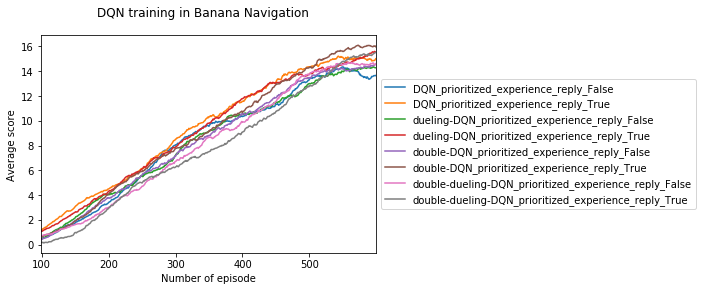

<h1>Table of Contents<span class="tocSkip"></span></h1>
<div class="toc"><ul class="toc-item"><li><span><a href="#Navigation" data-toc-modified-id="Navigation-1"><span class="toc-item-num">1&nbsp;&nbsp;</span>Navigation</a></span><ul class="toc-item"><li><ul class="toc-item"><li><span><a href="#1.-Start-the-Environment" data-toc-modified-id="1.-Start-the-Environment-1.0.1"><span class="toc-item-num">1.0.1&nbsp;&nbsp;</span>1. Start the Environment</a></span></li><li><span><a href="#2.-Examine-the-State-and-Action-Spaces" data-toc-modified-id="2.-Examine-the-State-and-Action-Spaces-1.0.2"><span class="toc-item-num">1.0.2&nbsp;&nbsp;</span>2. Examine the State and Action Spaces</a></span></li><li><span><a href="#3.-Take-Random-Actions-in-the-Environment" data-toc-modified-id="3.-Take-Random-Actions-in-the-Environment-1.0.3"><span class="toc-item-num">1.0.3&nbsp;&nbsp;</span>3. Take Random Actions in the Environment</a></span></li><li><span><a href="#4.-It's-Your-Turn!" data-toc-modified-id="4.-It's-Your-Turn!-1.0.4"><span class="toc-item-num">1.0.4&nbsp;&nbsp;</span>4. It's Your Turn!</a></span><ul class="toc-item"><li><span><a href="#Methods" data-toc-modified-id="Methods-1.0.4.1"><span class="toc-item-num">1.0.4.1&nbsp;&nbsp;</span>Methods</a></span></li><li><span><a href="#Extended-methods" data-toc-modified-id="Extended-methods-1.0.4.2"><span class="toc-item-num">1.0.4.2&nbsp;&nbsp;</span>Extended methods</a></span></li><li><span><a href="#Define-Q-learning-pipeline" data-toc-modified-id="Define-Q-learning-pipeline-1.0.4.3"><span class="toc-item-num">1.0.4.3&nbsp;&nbsp;</span>Define Q-learning pipeline</a></span></li><li><span><a href="#Training" data-toc-modified-id="Training-1.0.4.4"><span class="toc-item-num">1.0.4.4&nbsp;&nbsp;</span>Training</a></span></li><li><span><a href="#Plots" data-toc-modified-id="Plots-1.0.4.5"><span class="toc-item-num">1.0.4.5&nbsp;&nbsp;</span>Plots</a></span></li><li><span><a href="#Summary-of-the-results" data-toc-modified-id="Summary-of-the-results-1.0.4.6"><span class="toc-item-num">1.0.4.6&nbsp;&nbsp;</span>Summary of the results</a></span></li><li><span><a href="#Future-work" data-toc-modified-id="Future-work-1.0.4.7"><span class="toc-item-num">1.0.4.7&nbsp;&nbsp;</span>Future work</a></span></li></ul></li></ul></li></ul></li></ul></div>

# Navigation

---

In this notebook, you will learn how to use the Unity ML-Agents environment for the first project of the [Deep Reinforcement Learning Nanodegree](https://www.udacity.com/course/deep-reinforcement-learning-nanodegree--nd893).

### 1. Start the Environment

We begin by importing some necessary packages.  If the code cell below returns an error, please revisit the project instructions to double-check that you have installed [Unity ML-Agents](https://github.com/Unity-Technologies/ml-agents/blob/master/docs/Installation.md) and [NumPy](http://www.numpy.org/).


```python
from unityagents import UnityEnvironment
import numpy as np
```

Next, we will start the environment!  **_Before running the code cell below_**, change the `file_name` parameter to match the location of the Unity environment that you downloaded.

- **Mac**: `"path/to/Banana.app"`
- **Windows** (x86): `"path/to/Banana_Windows_x86/Banana.exe"`
- **Windows** (x86_64): `"path/to/Banana_Windows_x86_64/Banana.exe"`
- **Linux** (x86): `"path/to/Banana_Linux/Banana.x86"`
- **Linux** (x86_64): `"path/to/Banana_Linux/Banana.x86_64"`
- **Linux** (x86, headless): `"path/to/Banana_Linux_NoVis/Banana.x86"`
- **Linux** (x86_64, headless): `"path/to/Banana_Linux_NoVis/Banana.x86_64"`

For instance, if you are using a Mac, then you downloaded `Banana.app`.  If this file is in the same folder as the notebook, then the line below should appear as follows:
```
env = UnityEnvironment(file_name="Banana.app")
```


```python
env = UnityEnvironment(file_name="Banana.app")
```

    INFO:unityagents:
    'Academy' started successfully!
    Unity Academy name: Academy
            Number of Brains: 1
            Number of External Brains : 1
            Lesson number : 0
            Reset Parameters :
    		
    Unity brain name: BananaBrain
            Number of Visual Observations (per agent): 0
            Vector Observation space type: continuous
            Vector Observation space size (per agent): 37
            Number of stacked Vector Observation: 1
            Vector Action space type: discrete
            Vector Action space size (per agent): 4
            Vector Action descriptions: , , , 


Environments contain **_brains_** which are responsible for deciding the actions of their associated agents. Here we check for the first brain available, and set it as the default brain we will be controlling from Python.


```python
# get the default brain
brain_name = env.brain_names[0]
brain = env.brains[brain_name]
```

### 2. Examine the State and Action Spaces

The simulation contains a single agent that navigates a large environment.  At each time step, it has four actions at its disposal:
- `0` - walk forward 
- `1` - walk backward
- `2` - turn left
- `3` - turn right

The state space has `37` dimensions and contains the agent's velocity, along with ray-based perception of objects around agent's forward direction.  A reward of `+1` is provided for collecting a yellow banana, and a reward of `-1` is provided for collecting a blue banana. 

Run the code cell below to print some information about the environment.


```python
# reset the environment
env_info = env.reset(train_mode=True)[brain_name]

# number of agents in the environment
print('Number of agents:', len(env_info.agents))

# number of actions
action_size = brain.vector_action_space_size
print('Number of actions:', action_size)

# examine the state space 
state = env_info.vector_observations[0]
print('States look like:', state)
state_size = len(state)
print('States have length:', state_size)
```

    Number of agents: 1
    Number of actions: 4
    States look like: [1.         0.         0.         0.         0.84408134 0.
     0.         1.         0.         0.0748472  0.         1.
     0.         0.         0.25755    1.         0.         0.
     0.         0.74177343 0.         1.         0.         0.
     0.25854847 0.         0.         1.         0.         0.09355672
     0.         1.         0.         0.         0.31969345 0.
     0.        ]
    States have length: 37


### 3. Take Random Actions in the Environment

In the next code cell, you will learn how to use the Python API to control the agent and receive feedback from the environment.

Once this cell is executed, you will watch the agent's performance, if it selects an action (uniformly) at random with each time step.  A window should pop up that allows you to observe the agent, as it moves through the environment.  

Of course, as part of the project, you'll have to change the code so that the agent is able to use its experience to gradually choose better actions when interacting with the environment!


```python
env_info = env.reset(train_mode=False)[brain_name] # reset the environment
state = env_info.vector_observations[0]            # get the current state
score = 0                                          # initialize the score
while True:
    action = np.random.randint(action_size)        # select an action
    env_info = env.step(action)[brain_name]        # send the action to the environment
    next_state = env_info.vector_observations[0]   # get the next state
    reward = env_info.rewards[0]                   # get the reward
    done = env_info.local_done[0]                  # see if episode has finished
    score += reward                                # update the score
    state = next_state                             # roll over the state to next time step
    if done:                                       # exit loop if episode finished
        break
    
print("Score: {}".format(score))
```

    Score: 0.0


### 4. It's Your Turn!

Now it's your turn to train your own agent to solve the environment!  When training the environment, set `train_mode=True`, so that the line for resetting the environment looks like the following:
```python
env_info = env.reset(train_mode=True)[brain_name]
```
#### Methods

##### Basic
The Deep Q Network (DQN) which has been learned recently is a good solution for this project. As the instruction said, adjusting a little bit of the codes from the DQN project is enough. The below implementation codes are adapted from https://github.com/udacity/deep-reinforcement-learning/tree/master/dqn/solution 

#### Extended methods
Meanwhile, the course also introduced  
- dueling DQN which has two outputs from the neural network (value and advantage), DQN only with value. (https://arxiv.org/pdf/1511.06581.pdf)
- double DQN which use one network to choose the best action and the other to evaluate that action. (https://arxiv.org/pdf/1509.06461.pdf)
- prioritized experience reply which selects the sample according to the priorities. (https://arxiv.org/pdf/1511.05952.pdf)

Initially, only DQN solution was implemented but there are many implementation and comparison of the above methods. It would be interesting to try them for Banana-Navigation and see the different performance.

#### Define Q-learning pipeline


```python
from collections import deque
from dqn_agent import Agent # own dqn_agent.py
import matplotlib.pyplot as plt
import pandas as pd
import torch
import pickle
```

`dqn_agent` contains Agent class which has several implementations of value-based methods: DQN, dueling DQN, double DQN, and prioritized experience reply. The two arguments: `dqn_type` and `prioritized_reply` are used to control the type of method to use, e.g., `Agent(state_size=state_size, action_size=action_size, dqn_type='double-DQN', prioritized_reply=False, seed=0)`.

`dqn` function is used for training. The arguments controls different parameters during the training. If the training average score of the episode is over 13 (the requirement of Navigation project is 13), the training is good enough and will stop. 


```python
def dqn(env = None, agent = None, 
        n_episodes=2000, max_t=1000, 
        eps_start=1.0, eps_end=0.01, 
        eps_decay=0.995):
    """Deep Q-Learning.
    
    Params
    ======
        n_episodes (int): maximum number of training episodes
        max_t (int): maximum number of timesteps per episode
        eps_start (float): starting value of epsilon, for epsilon-greedy action selection
        eps_end (float): minimum value of epsilon
        eps_decay (float): multiplicative factor (per episode) for decreasing epsilon
    """
    scores = []                        # list containing scores from each episode
    scores_window = deque(maxlen=100)  # last 100 scores
    eps = eps_start                    # initialize epsilon
    n_episode_reach_requirement = None
    for i_episode in range(1, n_episodes+1):
        env_info = env.reset(train_mode=True)[brain_name]
        state = env_info.vector_observations[0]
        score = 0
        
        
        for t in range(max_t):
            action = agent.act(state, eps)
            env_info = env.step(action)[brain_name]
            next_state = env_info.vector_observations[0]   # get the next state
            reward = env_info.rewards[0]                   # get the reward
            done = env_info.local_done[0]   
            agent.step(state, action, reward, next_state, done)
            state = next_state
            score += reward
            if done:
                break 
        scores_window.append(score)       # save most recent score
        scores.append(score)              # save most recent score
        eps = max(eps_end, eps_decay*eps) # decrease epsilon
        print('\rEpisode {}\tAverage Score: {:.2f}'.format(i_episode, np.mean(scores_window)), end="")
        if i_episode % 100 == 0:
            print('\rEpisode {}\tAverage Score: {:.2f}'.format(i_episode, np.mean(scores_window)))
        if np.mean(scores_window)>=13.0: # requirement is 13
            if n_episode_reach_requirement is None:
                n_episode_reach_requirement = i_episode-100
                print('\nEnvironment solved in {:d} episodes!\tAverage Score: {:.2f}'.format(n_episode_reach_requirement, np.mean(scores_window)))
                torch.save(agent.qnetwork_local.state_dict(), 
                           "".join(dqn_type+"_prioritized_experience_"+str(prioritized_reply)+'_checkpoint.pth'))
#             break
    return scores, n_episode_reach_requirement
```

#### Training


Below is the different combinations of ["DQN", 'dueling-DQN', 'double-DQN', "double-dueling-DQN"] and using prioritized experience reply [False, True]. The initial idea to do like this way is to see how different training result and performance these methods can have. For each method, the maximum running episodes is 1500 and the maximum time steps is 800. Epsilon is set starts with 1.0 and ends with 0.01. The decay equal to 0.995. The other hyperparameters which are not seen in notebook but in .py files are

- BUFFER_SIZE: int(1e5)  # replay buffer size
- BATCH_SIZE: 64         # minibatch size
- GAMMA: 0.99            # discount factor
- TAU: 1e-3              # for soft update of target parameters
- LR: 5e-4               # learning rate 
- UPDATE_EVERY: 4        # how often to update the network
- ALPHA: 0.6             # reliance of sampling on prioritization
- BETA: 0.4              # reliance of importance sampling weight on prioritization


```python
s = dict()
n_episodes = dict()
dqn_types=["DQN", 'dueling-DQN', 'double-DQN', "double-dueling-DQN"]
prioritized_replys = [False, True]
for dqn_type in dqn_types:
    for prioritized_reply in prioritized_replys:
        print("Start training with", dqn_type, "; prioritized experience reply =", prioritized_reply)
        agent = Agent(state_size=state_size, action_size=action_size, 
                      dqn_type=dqn_type, prioritized_reply=prioritized_reply, seed=0)
        scores, n_episode_reach_requirement = dqn(env = env, agent = agent, n_episodes=600, max_t=500, eps_start=1.0, eps_end=0.01, eps_decay=0.995)
        s["".join(dqn_type + "_prioritized_experience_reply_"+str(prioritized_reply))] = scores
        n_episodes["".join(dqn_type + "_prioritized_experience_reply_"+str(prioritized_reply))] = n_episode_reach_requirement
        print("\n\n")
        
with open('training_scores.pickle', 'wb') as handle:
    pickle.dump(s, handle, protocol=pickle.HIGHEST_PROTOCOL)
    
with open('training_solved_in_n_episodes.pickle', 'wb') as handle:
    pickle.dump(n_episodes, handle, protocol=pickle.HIGHEST_PROTOCOL)
```

    Start training with DQN ; prioritized experience reply = False
    Episode 100	Average Score: 0.43
    Episode 200	Average Score: 3.33
    Episode 300	Average Score: 8.00
    Episode 400	Average Score: 10.39
    Episode 489	Average Score: 13.03
    Environment solved in 389 episodes!	Average Score: 13.03
    Episode 500	Average Score: 13.27
    Episode 600	Average Score: 13.66
    
    
    
    Start training with DQN ; prioritized experience reply = True
    Episode 100	Average Score: 1.12
    Episode 200	Average Score: 4.48
    Episode 300	Average Score: 8.43
    Episode 400	Average Score: 11.53
    Episode 441	Average Score: 13.02
    Environment solved in 341 episodes!	Average Score: 13.02
    Episode 500	Average Score: 14.35
    Episode 600	Average Score: 15.01
    
    
    
    Start training with dueling-DQN ; prioritized experience reply = False
    Episode 100	Average Score: 0.41
    Episode 200	Average Score: 4.04
    Episode 300	Average Score: 7.13
    Episode 400	Average Score: 10.53
    Episode 500	Average Score: 12.99
    Episode 501	Average Score: 13.01
    Environment solved in 401 episodes!	Average Score: 13.01
    Episode 600	Average Score: 14.28
    
    
    
    Start training with dueling-DQN ; prioritized experience reply = True
    Episode 100	Average Score: 1.06
    Episode 200	Average Score: 4.24
    Episode 300	Average Score: 7.82
    Episode 400	Average Score: 11.78
    Episode 441	Average Score: 13.03
    Environment solved in 341 episodes!	Average Score: 13.03
    Episode 500	Average Score: 13.75
    Episode 600	Average Score: 15.56
    
    
    
    Start training with double-DQN ; prioritized experience reply = False
    Episode 100	Average Score: 0.39
    Episode 200	Average Score: 3.75
    Episode 300	Average Score: 7.14
    Episode 400	Average Score: 10.47
    Episode 481	Average Score: 13.00
    Environment solved in 381 episodes!	Average Score: 13.00
    Episode 500	Average Score: 13.49
    Episode 600	Average Score: 14.55
    
    
    
    Start training with double-DQN ; prioritized experience reply = True
    Episode 100	Average Score: 0.61
    Episode 200	Average Score: 4.01
    Episode 300	Average Score: 7.68
    Episode 400	Average Score: 10.78
    Episode 457	Average Score: 13.01
    Environment solved in 357 episodes!	Average Score: 13.01
    Episode 500	Average Score: 14.26
    Episode 600	Average Score: 15.98
    
    
    
    Start training with double-dueling-DQN ; prioritized experience reply = False
    Episode 100	Average Score: 0.68
    Episode 200	Average Score: 2.93
    Episode 300	Average Score: 6.68
    Episode 400	Average Score: 9.94
    Episode 480	Average Score: 13.05
    Environment solved in 380 episodes!	Average Score: 13.05
    Episode 500	Average Score: 13.68
    Episode 600	Average Score: 14.60
    
    
    
    Start training with double-dueling-DQN ; prioritized experience reply = True
    Episode 100	Average Score: 0.18
    Episode 200	Average Score: 2.87
    Episode 300	Average Score: 6.22
    Episode 400	Average Score: 9.06
    Episode 500	Average Score: 12.74
    Episode 511	Average Score: 13.00
    Environment solved in 411 episodes!	Average Score: 13.00
    Episode 600	Average Score: 15.52
    
    
    


#### Plots


```python
dqn_types=["DQN", 'dueling-DQN', 'double-DQN', "double-dueling-DQN"]
prioritized_replys = [False, True]

for method, scores in s.items(): 
    print(method, "solved the problem in", n_episodes[method], 'episodes')
    # plot the scores
    plt.plot(np.arange(len(scores)), scores, label = method)
    plt.ylabel('Average score')
    plt.xlabel('Number of episode')
    plt.title(method)
    plt.savefig("".join(method+"traning_plot.pdf"))
    plt.show()
    print("\n\n")
```

    DQN_prioritized_experience_reply_False solved the problem in 389 episodes


    
    
    
    DQN_prioritized_experience_reply_True solved the problem in 341 episodes


    
    
    
    dueling-DQN_prioritized_experience_reply_False solved the problem in 401 episodes


    
    
    
    dueling-DQN_prioritized_experience_reply_True solved the problem in 341 episodes


    
    
    
    double-DQN_prioritized_experience_reply_False solved the problem in 381 episodes


    
    
    
    double-DQN_prioritized_experience_reply_True solved the problem in 357 episodes


    
    
    
    double-dueling-DQN_prioritized_experience_reply_False solved the problem in 380 episodes


    
    
    
    double-dueling-DQN_prioritized_experience_reply_True solved the problem in 411 episodes


    
    
    


```python
score_df = pd.DataFrame(s)
fig, ax = plt.subplots()
score_df.rolling(100).mean().dropna().plot(ax=ax)
ax.set_xlabel("Number of episode")
ax.set_ylabel("Average score")
fig.suptitle("DQN training in Banana Navigation")
ax.legend(loc='center left', bbox_to_anchor=(1, 0.5))
plt.savefig("multiple_traning_plot.pdf")
plt.show()
```





When finished, you can close the environment.


```python
env.close()
```

#### Summary of the results

As shown during training, all of the methods (DQN, dueling DQN, double DQN, and double dueling DQN with or without prioritized experience reply) achieved the goal (average score > 13.0). All of them solved the task within 500 episodes. In general, all the designs with prioritized experience reply perform better than the designs without prioritized experience reply. To my surprise, DQN with prioritized experience reply performs as the fast one to achieve the goal. I was expected double dueling DQN with prioritized experience reply gave me exciting result. Maybe the task is very easy, so simple method is enough to solve the task. 

#### Future work


The above training took quite long to finish with personal CPU laptop. To test how fast the job can be done, testing with different parameters on GPU could be an option. Later, the course will cover policy-based method, it could also be interesting if solving this problem without value-based methods. 
